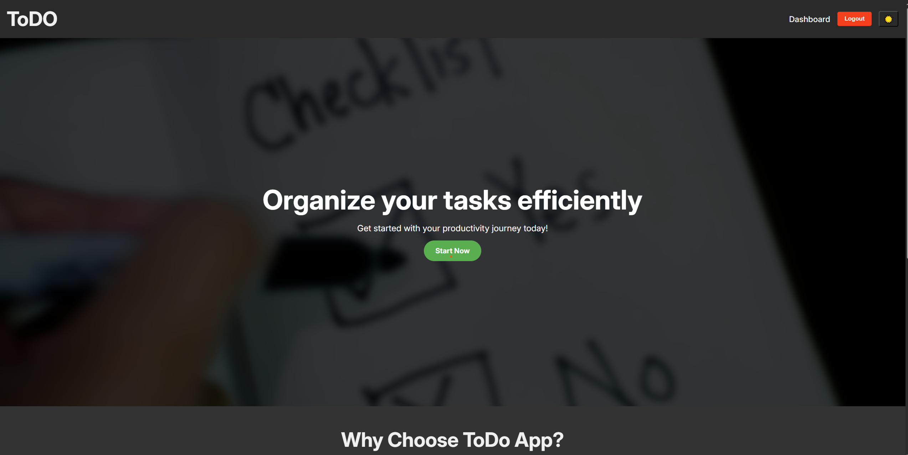
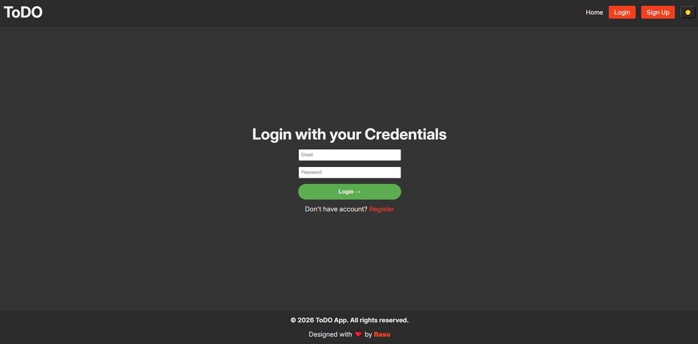
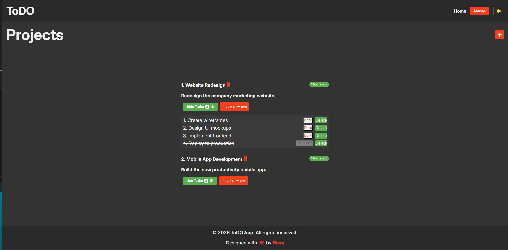
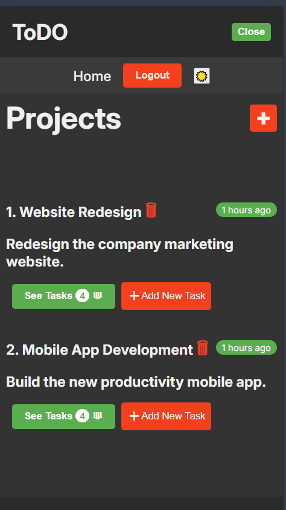
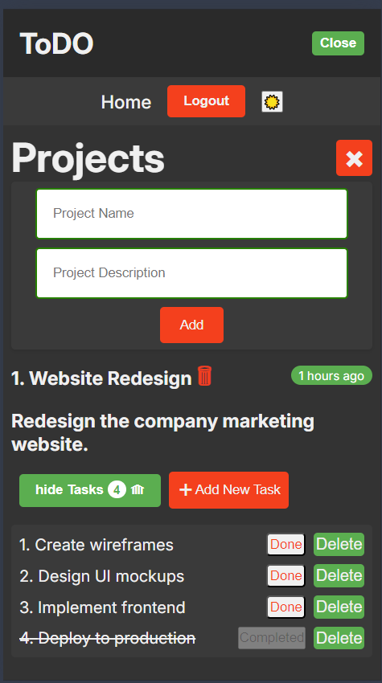
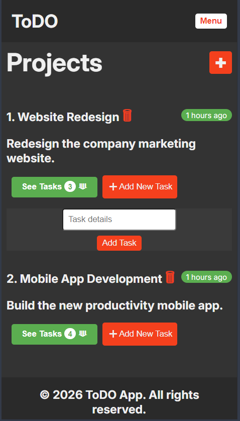
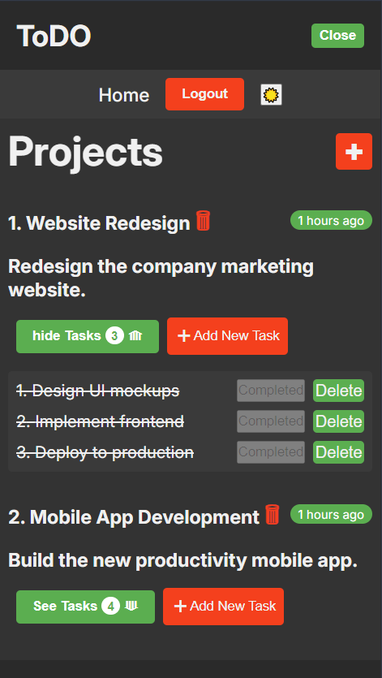

# Todo App - Laravel & React

A full-stack **Todo app** built with **Laravel** (backend) and **React** (frontend). Users can register, log in, create projects, and manage tasks.  

---

## Features

- User **registration** and **login**  
- Create, read, update, delete (**CRUD**) **projects**  
- Create, read, update, delete (**CRUD**) **tasks** under projects  
- Authentication using **Laravel Sanctum**  
- Responsive **React frontend** interacting with Laravel API  

---

## Folder Structure
```
todo-app/
    │
    ├─ backend/ <-- Laravel backend
    │ └─ ...
    │
    ├─ frontend/ <-- React frontend
    │ └─ ...
    │ 
    ├─ images/ 
    │
    └─ README.md <-- This file
```

## Technologies Used

**Backend**: Laravel, PHP, MySQL, Sanctum

**Frontend**: React, Axios, CSS(Vanilla)

**Version Control**: Git & GitHub

## Running Instructions
```bash
git clone https://github.com/Basudev-Pokharel/Todo-Full-Stack-App.git

cd Todo-Full-Stack-App

# Run Backend First
cd Backend
composer install
cd .env.example .env
php artisan key:generate
php artisan migrate --seed
php artisan serve

# Run Frontend now
cd Frontend
npm install
npm run dev
```


# Images for your reference
## Desktop 
<div style="display: grid; grid-template-columns: repeat(2, 1fr); gap: 10px; max-width: 800px; margin: auto;">
  
  
  
</div>

## Mobile
<div style="display: grid; grid-template-columns: repeat(2, 1fr); gap: 10px; max-width: 800px; margin: auto;">
  
  
  
  
  
</div>